# Chapter 2 — Environment Setup

[← Back to Contents](00_Contents.md) | [← Previous Lesson: Chapter 1 — Prerequisites & Introduction](01_Prerequisites_and_Introduction.md) | [Next Lesson: Chapter 3 — Some Basic Terminologies & Features of ROS2 →](03_Basic_Terminologies_and_Features_of_ROS2.md)

---

## Dual Booting Your Computer & Setting Up Ubuntu 22.04 LTS Version on it

In this section, I'm going to show you how to install Ubuntu on dual boot with your current operating system. This will allow you to decide at the moment of the boot of your PC which operating system to start (Windows or Ubuntu)

If otherwise, you prefer to install Ubuntu on a virtual machine and avoid creating a partition of your hard disk PC, then you can follow the following section in which I explain how to install Ubuntu on a Virtual Machine.

If you already have a PC with Ubuntu 22.04 or higher, then you can skip this lesson and move directly to the next one in which we will install ROS 2 on your machine.

### Download Ubuntu

Download the [Ubuntu 22.04](https://ubuntu.com/download/desktop) ISO from the official store and once the download is finished you can proceed to the creation of a USB for the installation of Ubuntu on your PC.

### Create a Boot USB

Once you have downloaded the Ubuntu ISO, you need to create a USB for the Boot of Ubuntu at the startup of your PC. To do so, you will need another tool called Rufus that you can download from [here,](https://rufus.ie/) and once downloaded you can run the executable.

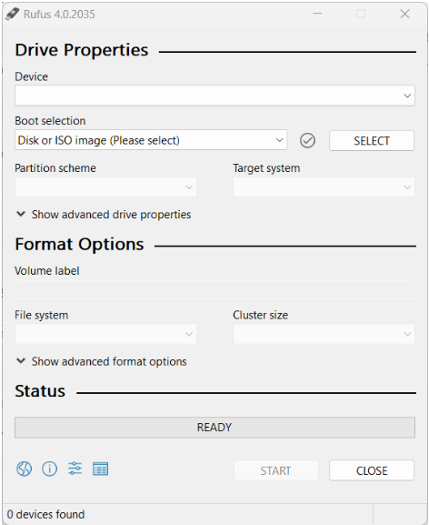

Plug the USB on your PC and in the section "Boot Selection" insert the directory of your PC where you downloaded the Ubuntu ISO in the previous step.

Once done with the configuration of Rufus, click on "Start" and wait until the program finishes the writing process of the ISO on the USB.

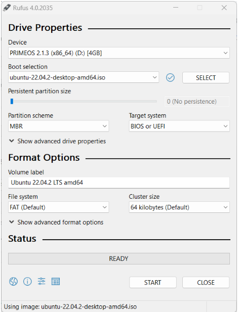

### Preparing Windows for the Dual Boot

Before installing Ubuntu, you need to reserve some space on your Hard Disk to be used by Ubuntu. I would suggest you reserve at least 30GB in order to install Ubuntu, ROS, and all the additional components needed in this course.

To create a partition in Windows click on Win + R and then diskmgmt.msc and click on "OK".

This will show you the storage space available on your PC and you will be able to create partitions of the disk and reserve space for other operating systems on the same computer.

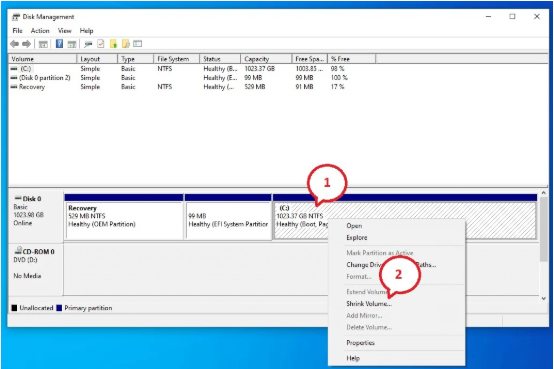

Then specify the size to be reserved for Ubuntu and once done click on "Shrink”

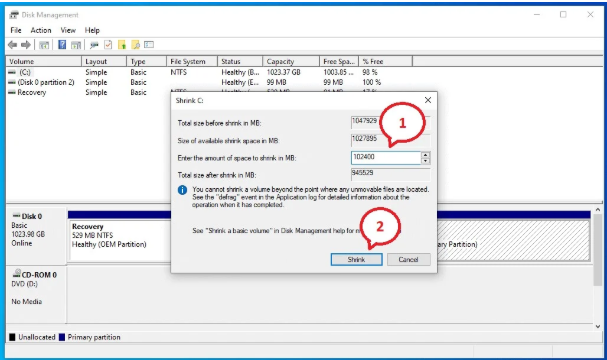

This will create a partition of your hard disk of the specified size

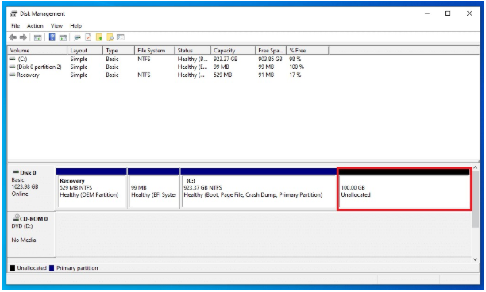

At this point, you are ready to install Ubuntu and all the components in this reserved area of the hard disk.

### Installing Ubuntu

Plug the USB in your PC on which you want to install Ubuntu and reboot your PC in advanced mode by clicking on "Advanced Startup". To do so, go into Windows settings and then "Update & Security"

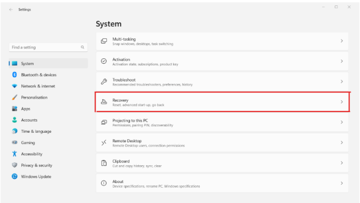

Then go to the "Recovery" tab and click on "Advanced Startup" and then on "Restart Now”

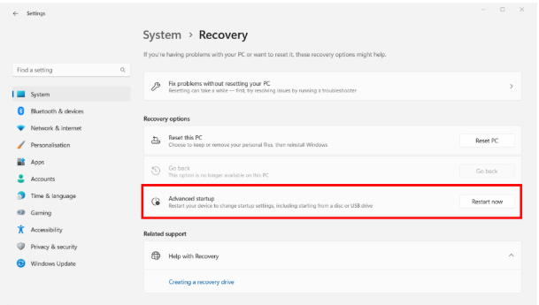

Windows will reboot in advanced mode and will ask you which action to take. Here click on "Use a device" to reboot your PC with the Ubuntu Boot installed in the USB.

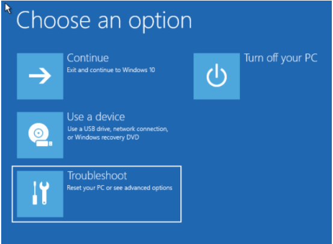

On the next startup of the PC, it will be booted with the operating system on the USB and you can start installing Ubuntu

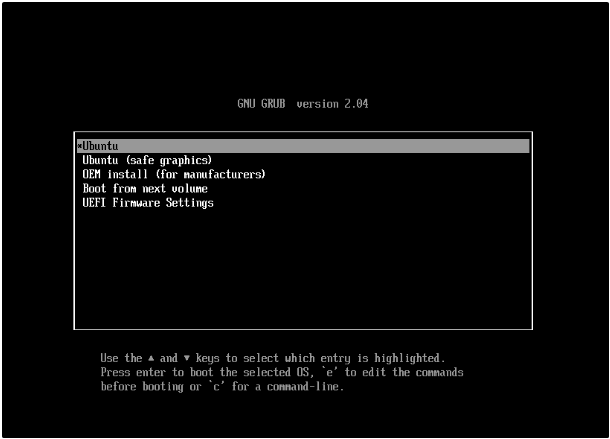

In the Ubuntu welcome window select "Install Ubuntu”

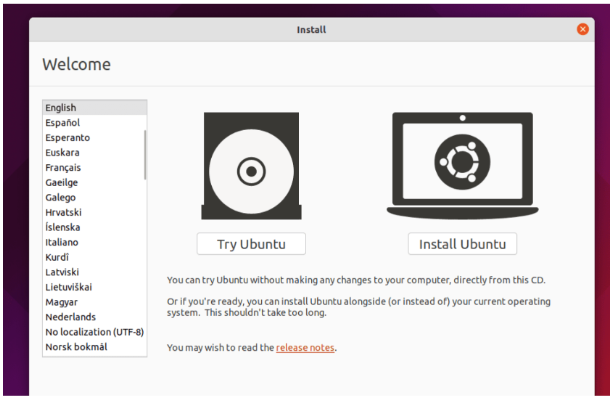

Then choose the configuration of your keyboard and click on "Continue”

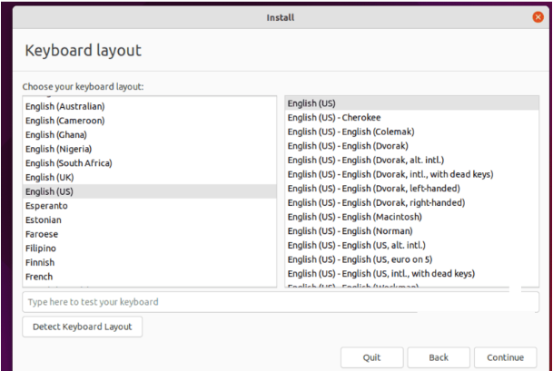

In the following window, you will be asked which kind of installation you want to execute. In order to have the full version of Ubuntu with all the components click on "Normal Installation" and during this phase, you will also be asked to automatically download the Ubuntu updates during the installation of the operating system. Also, you can choose to download and install third-party software like for example the drivers of your graphics card.

I would suggest you at least to select the voice "Download updates while installing Ubuntu" and then click on "Continue"

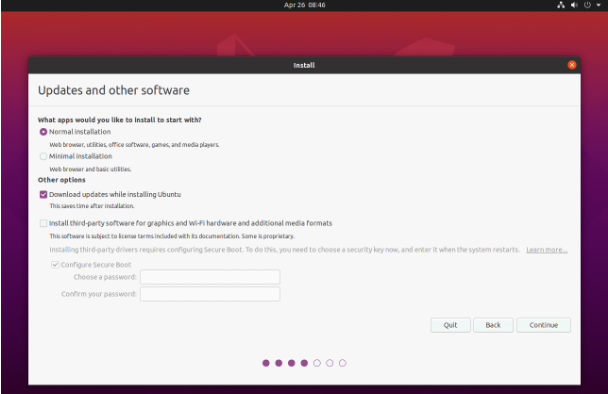

Finally, before proceeding with the installation of Ubuntu, you will be asked in which storage space you would like to install all the components. The system will automatically detect that you already have a version of Windows installed on your PC, so you'll see the option to "Install Ubuntu alongside Windows Boot Manager" and click "Continue”

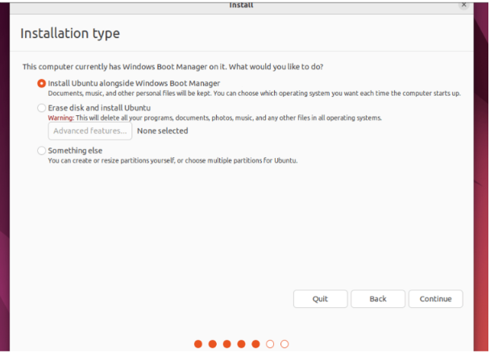

You can now choose the disk partition in which to install Ubuntu and then select the disk partition we freed in the previous steps and click "Install Now".

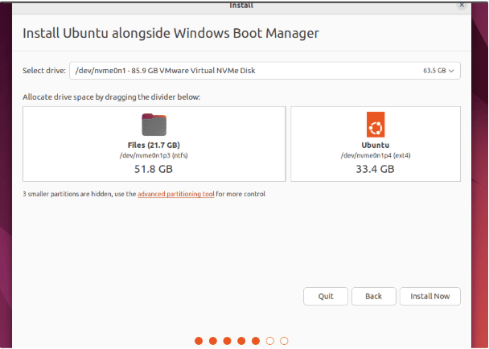

The installation configuration is now complete and the system will begin installing Ubuntu on the indicated hard disk partition.

During the installation procedure, you can start by configuring your PC with Ubuntu with the time zone of your area, username, and password for logging in to Ubuntu.

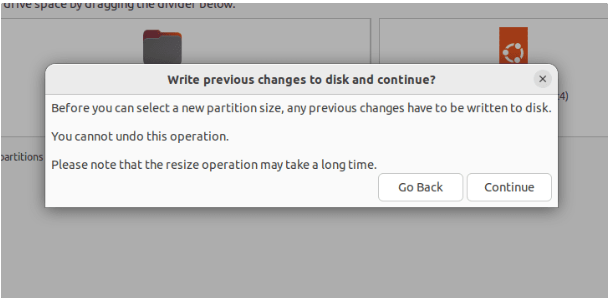

Then restart your PC by clicking on "Restart Now”

Now remove the USB with Ubuntu Boot that you inserted at the beginning of the installation and click "Enter" on your keyboard

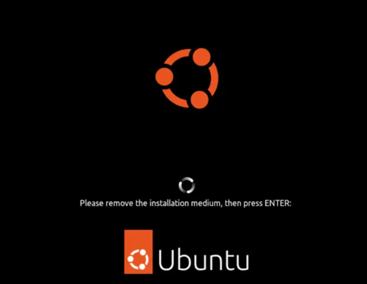

## Setting Up Ubuntu 22.04 LTS Version on VMWare Virtual Machine

If you are a Windows user and do not want to dual-boot your system to install Ubuntu, you can use the **VMware** software to create a **virtual machine** (VM) and install Ubuntu OS on it.

***System Requirements For Running Ubuntu On VM:***

- RAM: 16GB
- Memory: At least 20 GB (*The more the merrier*)
- Cores: 4

## Installing ROS2 Humble on Ubuntu OS:

1. **Open Terminal:** Shortcut for opening terminal is (**Ctrl + Alt + T**)
2. **Right Click on the Terminal icon** → Select “**Add to Favorites**” → So that we can access it easily in the future.
3. **Run** `sudo apt update`
4. **Install Tilix → Run** `sudo apt install tilix` → **Hit Y** → **Enter**.
5. **Configure Tilix** → Open Tilix Terminal → Click on **the 3-line-button** beside search button at the top of Tilix Terminal Window → Select **Preferences** → Go to **Default** Tab → Go to **Command** Tab → Check “**Run the command as a login shell**” → You can go to **Color** tab and do some design customizations of your own for the terminal.
6. Close all the terminals.
7. Reopen Tilix Terminal. You can add more terminals using the “Add terminal right” & “Add terminal down” buttons at the top- left of Tilix Terminal Window.
8. Go to the **ROS2 Humble Official Documentation** Site. ([https://docs.ros.org/en/humble/index.html](https://docs.ros.org/en/humble/index.html))
9. Click on **Installation** → Click on “**Debian Packages**” under “**Ubuntu Linux - Jammy Jellyfish (22.04)**”. The steps below are borrowed from the **Ubuntu (Debian)** page.
10. **Set Locale**: Run the following commands on Tilix terminal one by one.

    ```
    locale  # check for UTF-8

    sudo apt update && sudo apt install locales
    sudo locale-gen en_US en_US.UTF-8
    sudo update-locale LC_ALL=en_US.UTF-8 LANG=en_US.UTF-8
    export LANG=en_US.UTF-8

    locale  # verify settings
    ```


11. **(This step is not needed anymore) Troubleshooting For Future:** ([https://www.debugpoint.com/failed-connect-raw-githubusercontent-com-port-443/](https://www.debugpoint.com/failed-connect-raw-githubusercontent-com-port-443/))

    Run `sudo nano /etc/hosts`

    Then at the end of this file, add the IP address:

    `185.199.108.133 raw.githubusercontent.com`

    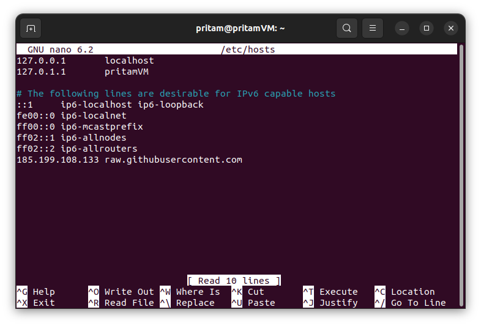

    Save and close the file.

12. **Setup Sources:** Run the following commands on Tilix terminal one by one.

```bash
# Updated Code
sudo apt install software-properties-common

sudo add-apt-repository universe

sudo apt update && sudo apt install curl -y

export ROS_APT_SOURCE_VERSION=$(curl -s https://api.github.com/repos/ros-infrastructure/ros-apt-source/releases/latest \
  | grep -F "tag_name" | awk -F\" '{print $4}')

curl -L -o /tmp/ros2-apt-source.deb "https://github.com/ros-infrastructure/ros-apt-source/releases/download/${ROS_APT_SOURCE_VERSION}/ros2-apt-source_\
${ROS_APT_SOURCE_VERSION}.\
$(. /etc/os-release && echo \
${UBUNTU_CODENAME:-\
${VERSION_CODENAME}})_all.deb"

sudo dpkg -i /tmp/ros2-apt-source.deb
```

13. **Install ROS 2 Packages:** Run the following commands on Tilix terminal one by one.

```
sudo apt update

sudo apt upgrade
#If you get any problem on running the above command.
#Try running "sudo dpkg --configure -a" to troubleshoot.
#Run "sudo apt upgrade" again.
```

- **Desktop Install (Recommended) - Used:** ROS, RViz, demos, tutorials:

    `sudo apt install ros-humble-desktop`

- **ROS-Base Install (Bare Bones) - Not Used**: Communication libraries, message packages, command line tools. No GUI tools.

    `sudo apt install ros-humble-ros-base`

- **Development tools - Used**: Compilers and other tools to build ROS packages

    `sudo apt install ros-dev-tools`

    Run the **Desktop Install (Recommended)** and **Development tools** commands from your terminal.

    ROS2 Humble is now successfully installed on your system.

    Cheers!

14. **Environment Setup (Sourcing the script):** You need to run this command every time you open a new terminal to use ROS 2 on it.

    ```
    source /opt/ros/humble/setup.bash
    # You need to run this command everytime you open a new terminal to use Ros2 on it.
    # Replace ".bash" with your shell if you're not using bash
    # Possible values are: setup.bash, setup.sh, setup.zsh
    ```


15. **Try some commands to see if it's working:**

    To check if you installed `ros-humble-desktop` correctly as instructed above, you can try the below commands.

    In one terminal, source the setup file and then run a C++ `talker`:

    ```
    source /opt/ros/humble/setup.bash
    ros2 run demo_nodes_cpp talker
    ```

    In another terminal source the setup file and then run a Python `listener`:

    ```
    source /opt/ros/humble/setup.bash
    ros2 run demo_nodes_py listener
    ```


You should see the `talker` saying that it’s `Publishing` messages and the `listener` saying `I heard` those messages. This verifies both the C++ and Python APIs are working properly.

Hooray!

16. **Automating the** `source /opt/ros/humble/setup.bash` **Command:** Go to **Tutorials** page of ROS2 Humble Documentation → Under **Beginner: CLI tools,** click on **Configuring environment →** Scroll down to **Add sourcing to your shell startup script section → Execute the below given command in a Terminal for one time** - and you won't have to run the command `source /opt/ros/humble/setup.bash` - every time you open a new terminal - for using ROS 2 - ever again!

    `echo "source /opt/ros/humble/setup.bash" >> ~/.bashrc`

17. **To check the version of ROS installed - on Terminal** - run the below command:

    `printenv | grep -i ROS`

18. **Uninstall:**

    ```
    sudo apt remove ~nros-humble-* && sudo apt autoremove

    sudo rm /etc/apt/sources.list.d/ros2.list
    sudo apt update
    sudo apt autoremove
    # Consider upgrading for packages previously shadowed.
    sudo apt upgrade
    ```


## Installing VS Code on Ubuntu OS:

1. **Install VS Code** from **Ubuntu Software Center.**
2. **Install VS Code Extensions**:
    - **C/C++ Extension Pack** by Microsoft.
    - **Python Extension Pack** by Don Jayamanne.
    - **XML** by Red Hat
    - **XML Tools** by Josh Johnson
    - **Robotics Developer Environment** by Ranch Hand Robotics LLC.
    - **Code Runner** by Jun Huan

3. Click on **Manage Gear Icon** at the left bottom corner of VS Code Window **→ Settings →** Extend the tab **Extensions →** Click on **ROS2** (Under Extensions) → Write **humble** in the box under **ROS2: Distro**

## Setting Up C++ Environment on Ubuntu OS:

1. First, check to see whether **GCC** is already installed on your Ubuntu system. To verify, open a Terminal window and enter the following command:

    `gcc -v`


2. If GCC isn't installed, run the following command from the terminal window to update the Ubuntu package lists. An out-of-date Linux distribution can sometimes interfere with attempts to install new packages.

    `sudo apt update`

    `sudo apt upgrade`

3. Next install the **GNU Compiler Tools** and the **GDB Debugger** with this command:

    `sudo apt-get install build-essential gdb`


## Setting Up Python Environment on Ubuntu OS:

You can download the Python package from the official Ubuntu repository. Here's how to do it:

1. Open up your terminal by pressing **Ctrl + Alt + T**.
2. **Upgrade and update Ubuntu to the latest version**

```bash
sudo apt update && sudo apt upgrade
```

3. Download and Install the latest version of Python:

```bash
sudo apt install python3
```

4. To check if **python** is successfully installed in your system, run the given command from any terminal:

    ```bash
    python3 --version
    ```


## Installing Terminator Terminal:

The advantage of using the **Terminator** terminal is that - it allows us to open multiple instances of terminals and to manage and view all the opened terminals from a single window screen. This feature comes in handy while developing ROS2 applications, since here we will be working with lots of terminals opened simultaneously. To install the Terminator Terminal:

1. Open up a new terminal by pressing **Ctrl + Alt + T**.
2. **Upgrade and update Ubuntu to the latest version:**

    ```bash
    sudo apt update && sudo apt upgrade
    ```

3. Run the following command from the same terminal:

    ```bash
    sudo apt-get install terminator
    ```

4. Some useful shortcuts while working with **Terminator:**
    - **Ctrl+Shift+E:** Open a new side terminal.
    - **Ctrl+Shift+O:** Open a new bottom terminal.
    - **Ctrl+Shift+W:** Close the currently active terminal.
    - **Ctrl+Shift+X:** Maximize the currently active terminal.
    - **Ctrl+Shift+Z:** Minimize the currently Maximized terminal.
    - **Alt+Up**: Move to the terminal above the current one.
    - **Alt+Down**: Move to the terminal below the current one.
    - **Alt+Left**: Move to the terminal left of the current one.
    - **Alt+Right**: Move to the terminal right of the current one.

---

[← Back to Contents](00_Contents.md) | [← Previous Lesson: Chapter 1 — Prerequisites & Introduction](01_Prerequisites_and_Introduction.md) | [Next Lesson: Chapter 3 — Some Basic Terminologies & Features of ROS2 →](03_Basic_Terminologies_and_Features_of_ROS2.md)

