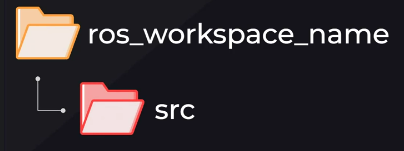
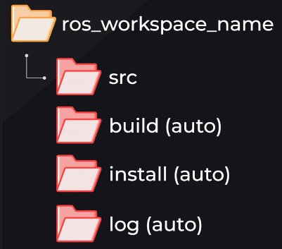
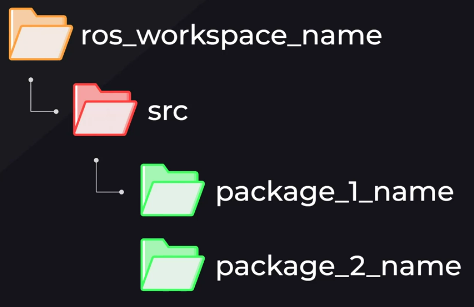
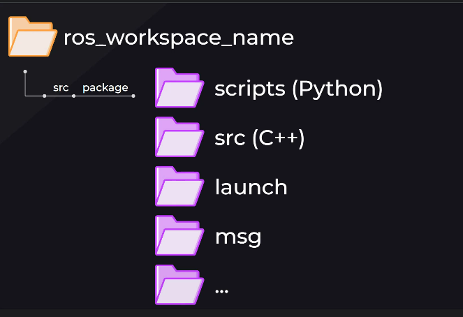
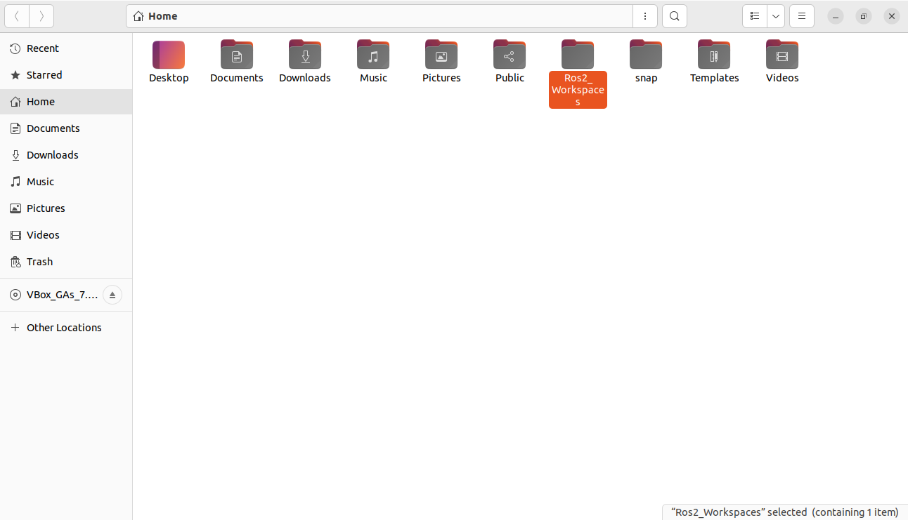
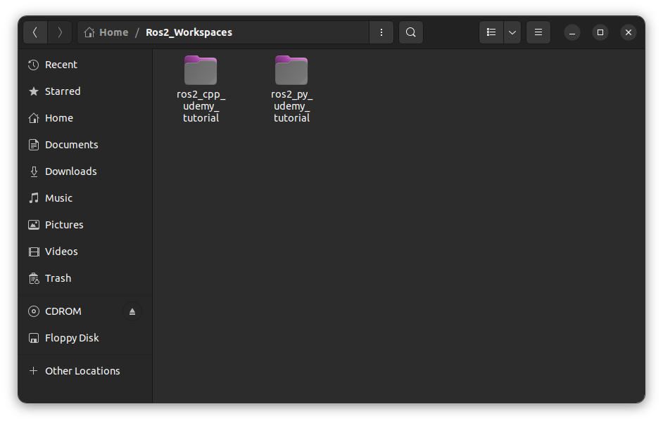
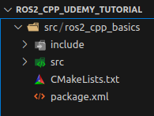
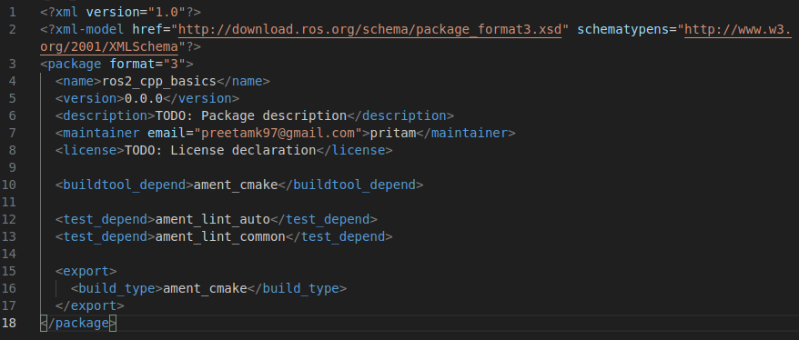
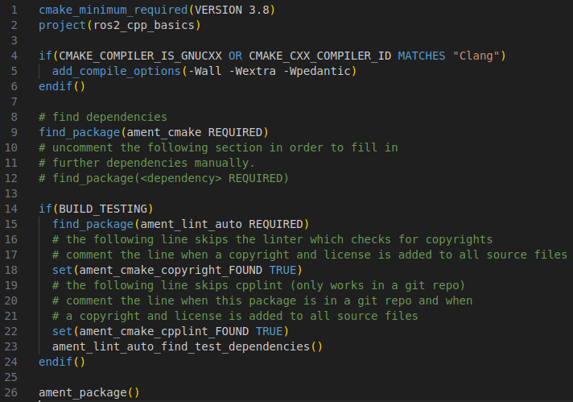
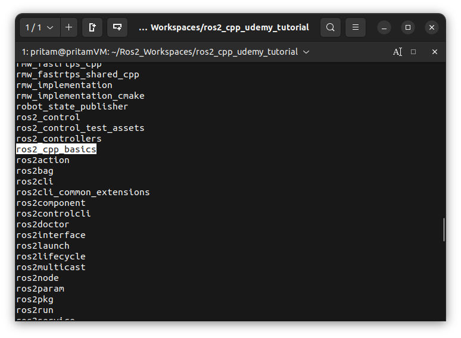

# Chapter 4 Setting Up A ROS2 Workspace (for both C++ & Python)

[← Back to Contents](00_Contents.md) | [← Previous: Chapter 3 — Some Basic Terminologies and Features of ROS2](03_Basic_Terminologies_and_Features_of_ROS2.md) | [Next: Chapter 5.1 — Creating a ROS2 Publisher (C++) →](05_Creating_ROS2_Publisher_Cpp.md)

---

All the new custom software packages and codes that we will be developing for a Robotics Project are placed inside a folder called **Ros2_Workspaces.**

In this chapter, we'll be going over creating a **ROS2 Workspace (for holding both C++ & Python codes)** where we can organize our development files. 

**Note:** 

- The folder where we installed ROS 2 and the other standard packages is called **Underlay.**
- While our workspace where we will develop all the new robot code is called **Overlay.** The overlay will have access to all the packages that are provided by the standard installation of ROS 2.  Furthermore, the overlay may not only contain all the new packages and codes that are developed for a specific robot, but can also include some of the packages that are already available in the standard ROS 2 installation. In the case, when a package with the exactly same name exists both in the underlay and in the overlay, the version that is in the Overlay will override the version that is available in the underlay.

# **ROS2 Workspace File Structure**

Before we do anything on our computer, let's get an illustration of what our file structure should look like.

1. First thing to start off our development is to create a **workspace directory**. 

1. Inside our **workspace directory**, we will create a **source folder (src)**, which is where the **ROS2 packages** we create will live.

1. Other folders, which will also appear in the workspace folder, are the **build, install** and **log** folders which will be auto generated when we compile our workspace.

1. Let us go ahead and focus more on the **source folder (src)** since that is where we will be organizing our project contents. As mentioned earlier, this **source folder** is where our **packages** will be placed. Think of packages like individual software bundles generally used for a specific task/role which can then be shared and distributed to other developers as well.

1. Let's go ahead and see what our package structure looks like. 
    
    
    
- **src:** This is the folder where we will store our **C++** codes for the package. **Auto-generated** - created automatically when we create our package**.**
- **package.xml:** This file **contains information about our package** such as the **ROS packages and systems we are using as dependencies** in this package as well as the **author** and **version number** of the package. **Auto-generated** - created automatically when we create our package**.**
- **CMakeLists.txt:** This file contains specific instructions on compiling our package. **Auto-generated** - created automatically when we create our package**.**
- **scripts:** This folder is **not auto-generated** folder . We create this folder manually to store our **Python** scripts for the package. Also, this folder must **mandatorily** **consist** a **blank** file by the name of **__init__.py** . Adding code to **__init__.py** is **optional.**
- Lastly, also keep in mind that within our package folder, we may also need to create **additional folders** (just like **scripts** folder) for storing a variety of other files such as **launch files**, **custom interface declarations**, **simulation configuration files** etc. as long as they pertain to the purpose of the project. We will go over these in more depth later in the course.

All right, now that you have a general overview of what our ROS2 Workspace File Structure should look like, let's go ahead and create our own workspace.

# **Steps For Creating A ROS2 Workspace**

1. Go to Home directory → **Create a new folder** by **right clicking** and clicking **new folder** → We will call this folder **Ros2_Workspaces**. This folder will contain all our ROS 2 workspaces. 
    
    
    
    > 💡 ROS2 Workspaces generally live in our Home directory
    

    

1. Go inside **Ros2_Workspaces** folder → Make a workspace folder named **ros2_cpp_udemy_tutorial (ros2_py_udemy_tutorial)**. 
    
    
   > 💡 Generally, a ROS 2 workspace folder is named after the robot we are working on. But for the purposes of this tutorial, we will call this workspace - **ros2_cpp_udemy_tutorial (ros2_py_udemy_tutorial)** , just so we know, that this is our workspace where we work on projects related to this course.
    
    

1. Go inside **ros2_cpp_udemy_tutorial (ros2_py_udemy_tutorial)** workspace folder → Create **source folder (src)**. This is the folder where we will create different packages related to the project.
1. Go inside the **source folder (src)**.
1. Inside the **source folder (src),** we are going to create a package folder named **udemy_ros2_pkg .** To do this **:** Open **source folder (src)** directory in a **terminal** → Run the command  `ros2 pkg create **udemy_ros2_pkg --**build-type ament_cmake`  → This will create a package folder named **udemy_ros2_pkg** inside **ros2_cpp_udemy_tutorial /src** folder.
4. Close all the terminals.

> 💡 If you are going to use **only** Python scripts in your ROS package (and no C++ codes), you can replace the `ament_cmake` part of the above to `ament_python`, in which case you would use a **setup.py** script to create your build instructions (instead of CMakeLists.txt), but then you would not be able to pass in your C++ build instructions, whereas `ament_cmake` allows us to use both C++ and Python codes.

>💡 If we go inside this **udemy_ros2_pkg** package ****folder we can see that ROS 2 has created some default files and folders for us which includes an **include** folder, a **src** folder, a **CMakeLists.txt** file & a **package.xml** file.  
>   
> So let's take a look at these generated files.
>- If we open the **package.xml** file in our VS Code using the terminal command `code package.xml` we can see different fields that describe our package. You generally want to fill these fields such as version, description, maintainer and license, before releasing your package to the public. 
> 
>- If we open the **CMakeLists.txt** file in our **VS Code** using the terminal command `code CMakeLists.txt`  - that opens it up in a new tab in VS Code → And after you trust it, just make sure that your language is set to **CMake** (At the bottom bar of VS Code). We will edit this file later in the course to tell the compiler about any dependencies we need for compiling our ROS package. 
> 
    

1. Create a folder named **scripts** inside our package folder **udemy_ros2_pkg -** for storing our **Python** scripts for this package. Also add a file named **__init__.py** inside it. For now, we do not need to add any code in this file. 
2. Now we are ready to **compile our ROS2 workspace**, using a build tool called **colcon.**

<aside>
💡 If you have already installed **colcon** on your system, skip the next steps **9, 10, 11,12,13,14**

</aside>

1. **Installing colcon →** Open up a browser and head over to the **ROS2 Humble Offcial Documentation** page → In the vertical navigation tab on the left side of the page - click on **Tutorials** Tab → This opens up the Tutorials page → Under heading **Beginner: Client libraries** - click on **Using [`colcon`](https://docs.ros.org/en/humble/Tutorials/Beginner-Client-Libraries/Colcon-Tutorial.html) to build packages** → This opens up the tutorials page for **Using `colcon` to build packages.** This will help us walk through the commands to install colcon and configure our terminal environment → Open a **new terminal →** In the browser, scroll down to **Prerequisites → Install colcon** → Copy the command `sudo apt install python3-colcon-common-extensions` and run it in terminal → You'll be prompted for your password. Go ahead - hit Y and enter → This installs the **colcon** into your Ubuntu OS 
2. In the browser, scroll down to the ”**Setup [`colcon_cd`](https://docs.ros.org/en/humble/Tutorials/Beginner-Client-Libraries/Colcon-Tutorial.html#id14)**” section.

<aside>
💡 Here we see two lines which will source the `colcon_cd` command so that we can use it in any new terminal we open. 
The command `colcon_cd` allows you to quickly change the current working directory of your shell to the directory of a package. As an example `colcon_cd some_ros_package`
would quickly bring you to the directory `~/ros2_ws/src/some_ros_package`

</aside>

1. Copy and paste the commands under ”**Setup [`colcon_cd`](https://docs.ros.org/en/humble/Tutorials/Beginner-Client-Libraries/Colcon-Tutorial.html#id14)**” section on the terminal and run them.
    
    `echo "source /usr/share/colcon_cd/function/colcon_cd.sh" >> ~/.bashrc
    echo "export _colcon_cd_root=/opt/ros/humble/" >> ~/.bashrc`
    
2. Next scroll down to **Setup `colcon` tab completion** section.

<aside>
💡 This allows you to hit the tab key on your keyboard and autocomplete while writing your **colcon build** commands

</aside>

1. Copy and paste the commands under **Setup `colcon` tab completion** section on the terminal and run them.

`echo "source /usr/share/colcon_argcomplete/hook/colcon-argcomplete.bash" >> ~/.bashrc`

1. Close the old terminal.
2. Open a new terminal from **ros2_cpp_udemy_tutorial (ros2_py_udemy_tutorial)** workspace directory.
3. Even though we haven't created any new code yet, we can go ahead and build/compile our workspace. We can do this by running the `colcon build` command in the terminal from **ros2_cpp_udemy_tutorial (ros2_py_udemy_tutorial)** workspace directory.

<aside>
💡 Be sure to run this command from your workspace folder and not within your package folder.

</aside>

       So our workspace has successfully been built.

<aside>
💡 Now, if we go over to our File Explorer → **Ros2_Workspaces** folder→ **ros2_cpp_udemy_tutorial (ros2_py_udemy_tutorial)**  workspace folder → We can see the newly created folders **build**, **install** and **log** in our workspace folder which are created by default when we build our workspace.

</aside>

1. To add our newly created package **udemy_ros2_pkg** to our terminal environment - we need to source the `setup.bash` file present in the **install** folder of our **ros2_cpp_udemy_tutorial (ros2_py_udemy_tutorial)** workspace folder. So run the following command in the terminal -
    
    `source install/setup.bash` from the **ros2_cpp_udemy_tutorial (ros2_py_udemy_tutorial)**  workspace folder.
    

<aside>
💡 Now our terminal is aware of our workspace, and all the packages within it - including our newly created ROS package **udemy_ros2_pkg**.

</aside>

1. Run `ros2 pkg list`  command from the same terminal. This gives us a full list of all the available ros2 packages to us in our OS, but most notably the one we just created which is our **udemy_ros2_pkg** package.
    
    
    

**Congratulations !**

You have successfully created your very own ROS2 Workspace.

---

[← Back to Contents](00_Contents.md) | [← Previous: Chapter 3 — Some Basic Terminologies and Features of ROS2](03_Basic_Terminologies_and_Features_of_ROS2.md) | [Next: Chapter 5.1 — Creating a ROS2 Publisher (C++) →](05_Creating_ROS2_Publisher_Cpp.md)
