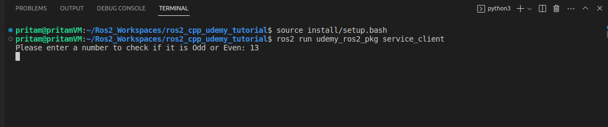
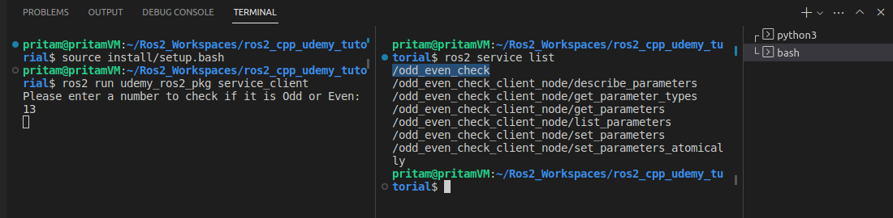

# Chapter 24 — Creating a Service Client (C++)

[← Back to Contents](00_Contents.md) | [← Previous Lesson: Chapter 23 — Creating a Custom Service Interface (C++)](23_Creating_a_Custom_Service_Interface_Cpp.md) | [Next Lesson: Chapter 25 — Creating a Service Server (C++) →](25_Creating_a_Service_Server_Cpp.md)

---

In this lesson, we are going to create a **C++ Service Client Node** for the **OddEvenCheck.srv** custom service interface that we created in the last lesson.

> **💡 Note:** **Service Client**
>
> The node which sends a **request message** to the **service server** node.

1. Open your **VS Code** in **Workspace Directory**.
2. Create a **service_client.cpp** file in the **src** directory of the **udemy_ros2_pkg** package folder.
3. Add the following code to the **service_client.cpp** file:

    ```cpp
    #include "rclcpp/rclcpp.hpp"
    #include "cpp_srv/srv/odd_even_check.hpp"
    #include <chrono>
    #include <cstdlib>
    #include <memory>

    using namespace std::chrono_literals;

    int main(int argc, char **argv)
    {
      rclcpp::init(argc, argv);

      // 1. Check for command line arguments
      if (argc != 2) {
          RCLCPP_INFO(rclcpp::get_logger("rclcpp"), "Something is wrong please try again !");
          return 1;
      }

      // 2. Create Node and Client
      std::shared_ptr<rclcpp::Node> node = rclcpp::Node::make_shared("odd_even_check_client");

      rclcpp::Client<cpp_srv::srv::OddEvenCheck>::SharedPtr client =
        node->create_client<cpp_srv::srv::OddEvenCheck>("odd_even_check");

      // 3. Create the Request
      auto request = std::make_shared<cpp_srv::srv::OddEvenCheck::Request>();
      request->number = atoll(argv[1]); // atoll = ASCII to Long Long

      // 4. Wait for the service to be available (Standard Loop)
      while (!client->wait_for_service(1s)) {
        if (!rclcpp::ok()) {
          RCLCPP_ERROR(rclcpp::get_logger("rclcpp"), "Interrupted while waiting for the service. Exiting.");
          return 0;
        }
        RCLCPP_INFO(rclcpp::get_logger("rclcpp"), "service not available, waiting again...");
      }

      // 5. Send Async Request
      auto result = client->async_send_request(request);
      // Below line of code pauses the entire program.
      // The code cannot move past this line until the server answers.
      auto result_status = rclcpp::spin_until_future_complete(node, result);

      // 6. Wait for the result using spin_until_future_complete
      if (result_status == rclcpp::FutureReturnCode::SUCCESS)
      {
        RCLCPP_INFO(rclcpp::get_logger("rclcpp"), "Decision: %s", result.get()->decision.c_str());
      } else {
        RCLCPP_ERROR(rclcpp::get_logger("rclcpp"), "Failed to call service odd_even_check");
      }

      rclcpp::shutdown();
      return 0;
    }
    ```

4. Save the file and head over to the **CMakeLists.txt** file within the **udemy_ros2_pkg** package folder.

    Do the following **boldified** additions to the **CMakeLists.txt** file:

    ```c
    cmake_minimum_required(VERSION 3.8)
    project(udemy_ros2_pkg)

    if(CMAKE_COMPILER_IS_GNUCXX OR CMAKE_CXX_COMPILER_ID MATCHES "Clang")
      add_compile_options(-Wall -Wextra -Wpedantic)
    endif()

    # find dependencies
    find_package(ament_cmake REQUIRED)
    find_package(rclcpp REQUIRED)
    find_package(std_msgs REQUIRED)
    # Necessary import for using Custom Service Interfaces
    find_package(rosidl_default_generators REQUIRED)

    if(BUILD_TESTING)
      find_package(ament_lint_auto REQUIRED)
      set(ament_cmake_copyright_FOUND TRUE)
      set(ament_cmake_cpplint_FOUND TRUE)
      ament_lint_auto_find_test_dependencies()
    endif()

    # We need to tell our ros2 compiler - the exact specifics of the newly created custom service interface file - that it needs to have the IDL Code generated for.
    # This line of code should always come before the add_excutable blocks, if you are planning to use the generated custom interface in these executables.
    rosidl_generate_interfaces(${PROJECT_NAME} "srv/OddEvenCheck.srv" ADD_LINTER_TESTS)

    # Set support for using custom interfaces in C++ from this package
    # This line should always be below the "rosidl_generate_interfaces()" code - otherwise it will produce compilation error.
    rosidl_get_typesupport_target(cpp_typesupport_target "${PROJECT_NAME}" "rosidl_typesupport_cpp")

    add_executable(publisher src/publisher.cpp)
    ament_target_dependencies(publisher rclcpp std_msgs)

    add_executable(subscriber src/subscriber.cpp)
    ament_target_dependencies(subscriber rclcpp std_msgs)

    add_executable(rpm_publisher src/rpm_publisher.cpp)
    ament_target_dependencies(rpm_publisher rclcpp std_msgs)

    add_executable(rpm_subscriber src/rpm_subscriber.cpp)
    ament_target_dependencies(rpm_subscriber rclcpp std_msgs)

    add_executable(service_client src/service_client.cpp)
    ament_target_dependencies(service_client rclcpp std_msgs)
    target_link_libraries(service_client "${cpp_typesupport_target}")

    install(TARGETS
            publisher
            subscriber
            rpm_publisher
            rpm_subscriber
    				service_client
            DESTINATION lib/${PROJECT_NAME}
    )

    install(
      DIRECTORY
      launch
      DESTINATION share/${PROJECT_NAME}
    )

    ament_package()
    ```

5. Save all the files and **compile** the **workspace.**
6. To run the **service_client** node, open a new terminal in the **workspace** directory and run the following commands:

    ```bash
    source install/setup.bash
    ros2 run udemy_ros2_pkg service_client
    ```

    

7. Open a **parallel** terminal and run the following command:

    ```bash
    ros2 service list
    #To see the list of active services
    ```

    

---

[← Back to Contents](00_Contents.md) | [← Previous Lesson: Chapter 23 — Creating a Custom Service Interface (C++)](23_Creating_a_Custom_Service_Interface_Cpp.md) | [Next Lesson: Chapter 25 — Creating a Service Server (C++) →](25_Creating_a_Service_Server_Cpp.md)

