# Chapter 26 — Creating Services (Python)

[← Back to Contents](00_Contents.md) | [← Previous Lesson: Chapter 25 — Creating a Service Server (C++)](25_Creating_a_Service_Server_Cpp.md) | [Next Lesson: Chapter 27 — Project 3 — Using OpenCV with ROS2 Services (C++) →](27_Project_Using_OpenCV_with_ROS2_Services_Cpp.md)

---

- **ROS2 Services** are **interfaces** with a **request-response architecture** which the nodes (**service-client** & **service-server**) can use to communicate with each other.
- There are two types of nodes that use a **service interface**:
    - **service-client:** Nodes that send a **service-request**.
    - **service-server:** Node that **receives** the **request** from the **service_client**, **processes** it, and sends a **response** back to the **service_client.**
    - In this lesson, we are creating a **simple custom ROS2 service** of our own, which given an **integer number** will return a **string decision** stating whether the given **number** is odd or even.

## Step 1: Creating a Custom ROS2 Service Interface

- To see the list of currently available ROS2 Interfaces, run the `ros2 interface list` command from any terminal.

    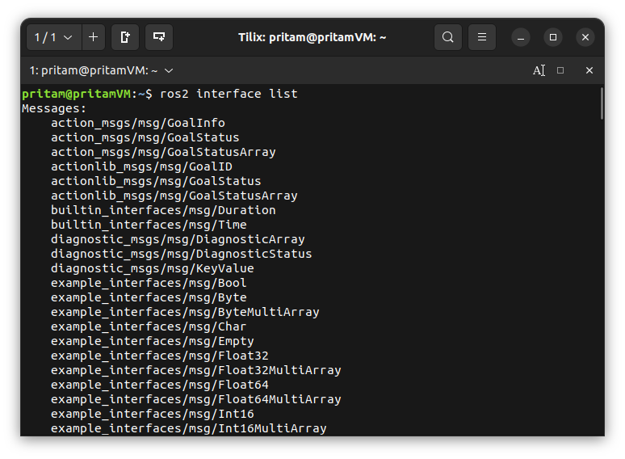

- To see the **code contents** of any particular ROS Interface, run the following command from any terminal.

    ```bash
    ros2 interface show std_srvs/srv/SetBool
    # ros2 interface show complete_interface_name
    ```

    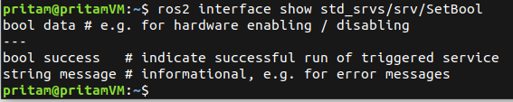

    In the above picture, we are looking at the contents of **std_srvs/srv/SetBool** interface. It is a built-in **service interface** that comes with ROS2 installation. If we observe its code contents carefully, we can see two sections separated by 3 dashes (**---**). The top section/part describes the **request** message (`bool data`) and the bottom part describes the **response** message(s) (`bool success` & `string message`).

    Now, we are going to create our own **custom ROS2 service interface** which follows the above format.


- Open your **ros2_py_udemy_tutorial** workspace folder in **VS Code**.
- Create a new folder **srv** inside the **udemy_ros2_pkg** package folder — to store our custom service interfaces.
- Inside **srv** folder, create a **new file** named **OddEvenCheck.srv.**

    > **💡 Note:** By convention, **interface** files in ROS always follow **Pascal Casing Format** (Ex - OutOfBoundsException) for naming.

- Add the following code to **OddEvenCheck.srv** file.

    ```bash
    int64 number
    ---
    string decision
    ```

    **int64** & **string** are two of many **built-in ROS2 Primitive Datatypes** that are used for defining various messages (like *integers, booleans, strings*) that nodes share among each other. Below table lists some available built-in primitive datatypes in ROS that we can use when creating custom interfaces.

    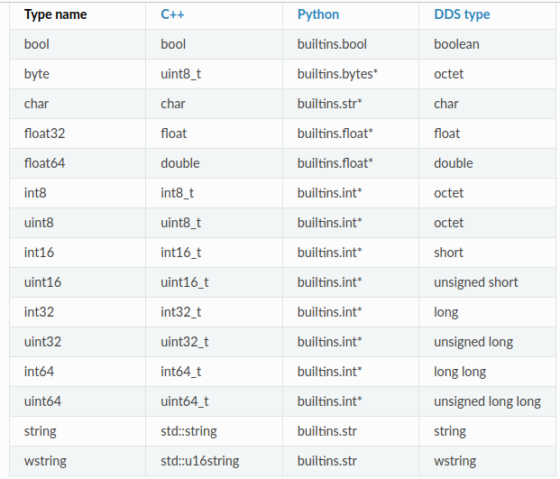


- Save the file **OddEvenCheck.srv.**
- Now we need to configure our package, so that it knows about our custom service interface and it can generate the code needed for using these custom interfaces within our Python codes.

    So next, go ahead and open the **package.xml** file. Add the following code to it.

    ```xml
    <!-- Adding the below dependencies in order to be able to use our Custom ROS Service Inteface OddEvenCheck.srv -->
      <build_depend>rosidl_default_generators</build_depend>
      <!-- The above build_dependency is used to generate the idl(interactive data language) code for our Custom ROS Service Intefaces -->
      <exec_depend>rosidl_default_runtime</exec_depend>
      <!-- Above dependency is added so that the the idl(interactive data language) code can be used at node runtime. -->
      <member_of_group>rosidl_interface_packages</member_of_group>
      <!-- Above dependency is added to include our Custom Service Intefaces into the ROS2 Interfaces List.  -->
    ```


- Save the file **package.xml.**
- Open **CMakeLists.txt** file of **udemy_ros2_pkg** package and add the following code to it.

    ```c
    # Adding the below dependency for configuring all the
    # Custom ROS Service Interfaces created inside this package.
    find_package(rosidl_default_generators REQUIRED)

    # Telling our compiler exactly what new custom interfaces files we have created in our package
    # that needs to have the ros idl code generated for it.
    rosidl_generate_interfaces(${PROJECT_NAME}
      "srv/OddEvenCheck.srv"
    )
    # ${PROJECT_NAME} signifies the name of our package (udemy_ros2_pkg)
    ```

- Save the file **CMakeLists.txt.**
- With that, we have set up our package to be able to use our new **custom service interface** that we have just created — in our python codes.
- Now, since we have recently added a new file (**OddEvenCheck.srv**) to our package, therefore, make sure to recompile the workspace once before proceeding any further.

    > **Note**: This time during compilation of our workspace, our **udemy_ros2_pkg** package will generate some **IDL** codes - for us to be able to use our **custom service interface** in our python codes - and hence it may take a bit more time for our workspace compilation than usual.
    >

- Now open a new terminal in the workspace folder and run the following commands.

    ```bash
    source install/setup.bash
    ros2 interface list
    ```

    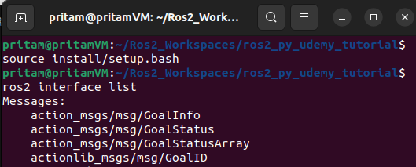

    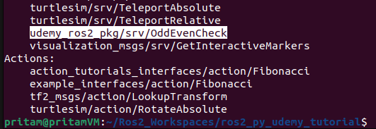

    This time we can see a new interface named **udemy_ros2_pkg/srv/OddEvenCheck** listed in the output.

- Lastly, from the same terminal, run the below command to see the code that we just put within our newly created **OddEvenCheck.srv** custom service interface file.

    ```bash
    ros2 interface show udemy_ros2_pkg/srv/OddEvenCheck
    ```

    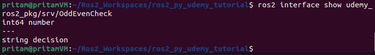


## Step 2: Creating a ROS2 Service Server Node

- Create a new file named **service_server.py** inside the **scripts** folder of your **udemy_ros2_pkg** package folder.
- Add the following code to **service_server.py** file.

    ```python
    #! /usr/bin/env python3

    # The above line is called a shebang line.
    # On Linux, a shebang (#!) is a special line at the beginning of a
    # script that tells the operating system which interpreter to use when
    # executing the script. This line, also known as a hashbang, shabang or
    # "sharp-exclamation", is the first line of a dash and starts with "#!"
    # followed by the path to the interpreter.

    import rclpy
    from rclpy.node import Node

    from udemy_ros2_pkg.srv import OddEvenCheck

    class OddEvenCheckServer(Node):
        def __init__(self):
            super().__init__("odd_even_check_server_node")
            self.server = self.create_service(OddEvenCheck, 'odd_even_check', self.determine_odd_even)

        def determine_odd_even(self, request, response):
            print("Request is recieved...")
            if (request.number%2 != 0):
                response.decision = "The number is Odd"
            elif (request.number%2 == 0):
                response.decision = "The number is Even"
            else:
                response.decision = "Error ! You have not given a number."

            print(request)
            print(response)

            return response


    def main(args=None):
        rclpy.init()
        print("Odd Even Check Server is running...")
        server_node =  OddEvenCheckServer()

        try:
            rclpy.spin(server_node)

        except KeyboardInterrupt:
            print("Terminating Server Node...")
            server_node.destroy_node()

    if __name__=='__main__':
        main()
    ```


- Save the **service_server.py** file.
- Open the **CMakeLists.txt** file and add the following code to it.

    ```c
    # Specifying our python scripts.
    install(PROGRAMS
      scripts/service_server.py
      DESTINATION lib/${PROJECT_NAME}
    )
    ```

- Save the **CMakeLists.txt** file.
- Before proceeding further, rebuild the workspace again.
- To test our newly created **service_server.py** node, open a new terminal in the workspace folder and run the following commands.

    ```bash
    source install/setup.bash
    ros2 run udemy_ros2_pkg service_server.py
    ```

    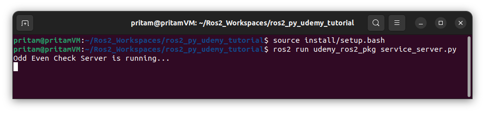

- Now **keeping the last terminal parallely open**, open a new terminal in your workspace folder and run the following terminal commands.

    ```bash
    ros2 service list
    # shows the list of active services
    ```

    In the output, we can see our **'odd_even_check'** service being listed.

    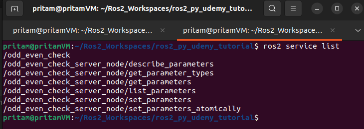

    > **💡 Note:** While keeping the **service_server.py** terminal open, go to your **VS Code** and hit the **Shift + Ctrl + P →** this opens up the **“Show All Commands”** panel → there if you type **ros,** you can see various commands available to us through the **ROS Extension** of VS Code → from there, on selecting the **“ROS: Show Status”** command, we can see a new side tab opening within the VS Code window named **“ROS2 System Status”,** which lists all the nodes, topics, services currently active in our ROS Terminal Environment.

- We can interact with our **service_server.py** node even without having a service client node yet.

    To do that, keep the **service_server.py** node running in a separate terminal and open a new terminal in the workspace folder and run the following commands.

    ```bash
    source install/setup.bash
    ros2 service call /odd_even_check udemy_ros2_pkg/srv/OddEvenCheck number:\5\

    # In the above command, /odd_even_check is the service topic name and udemy_ros2_pkg/srv/OddEvenCheck is the name of the service interface that we  created and number:\5\ is the request message that we are sending to the service server. Here we are checking whether number 5 is odd or even.
    ```

    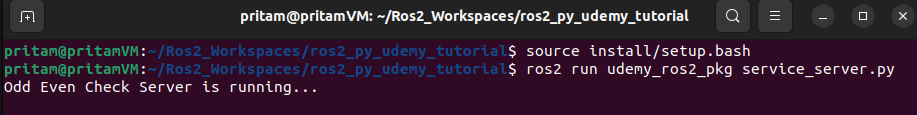

    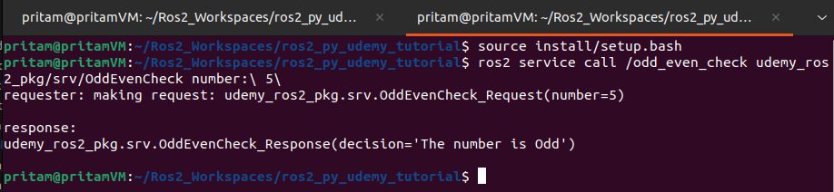


## Step 3: Creating a ROS2 Service Client Node

- Create a new file named **service_client.py** inside the **scripts** folder of your **udemy_ros2_pkg** package folder.
- Add the following code to the **service_client.py** file:

    ```python
     #! /usr/bin/env python3

    import rclpy
    from rclpy.node import Node

    from udemy_ros2_pkg.srv import OddEvenCheck

    class OddEvenCheckClient(Node):
        def __init__(self):
            super().__init__("odd_even_check_client_node")
            self.client = self.create_client(OddEvenCheck, 'odd_even_check')
            self.req = OddEvenCheck.Request()

        def send_request(self, num):
            self.req.number = int(num)
            print("waiting for service to become active...")
            self.client.wait_for_service()
            self.future = self.client.call_async(self.req)
            rclpy.spin_until_future_complete(self, self.future)

            self.result = self.future.result()
            return self.result


    def main(args=None):
        rclpy.init()
        client_node = OddEvenCheckClient()
        print("Odd Even Check Client Node is running...")

        try:
            number_input = input("Enter an integer: ")
            result = client_node.send_request(number_input)
            print("Server Returned: " + result.decision)

        except KeyboardInterrupt:
            print("Aborting Odd Even Check Client Node")
            client_node.destroy_node()

    if __name__=='__main__':
        main()
    ```

- Save the **service_client.py** file.
- Open the **CMakeLists.txt** file of the package and add the following code to it.

    ```c
    # Specifying our python scripts.
    install(PROGRAMS
      scripts/service_server.py
      scripts/service_client.py
      DESTINATION lib/${PROJECT_NAME}
    )
    ```

- Save the **CMakeLists.txt** file and rebuild the project before proceeding any further.

## Step 4: Running Our Newly Created Service Server and Service Client Nodes

- To start the **service server** node, open a new terminal from the workspace folder and run the following terminal commands:

    ```bash
    source install/setup.bash
    ros2 run udemy_ros2_pkg service_server.py
    ```

    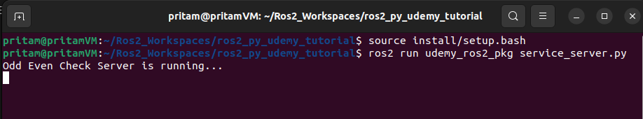


- Keep the previous terminal parallely open.

    To start the **service client** node, open a new terminal from the workspace folder and run the following terminal commands:

    ```bash
    source install/setup.bash
    ros2 run udemy_ros2_pkg service_client.py
    ```

    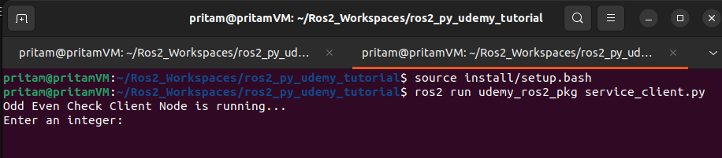

- The service client is asking to enter an integer. Service client will send this integer to service server to check whether the given number is odd or even. Let us enter the number 5 and check the result. After entering the number, press **Enter**.

    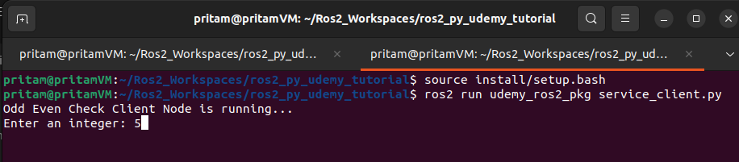


- Observe the output of the **service client** terminal.

    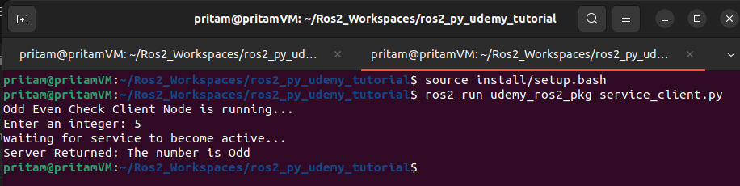

- Observe the output of the **service server** terminal.

    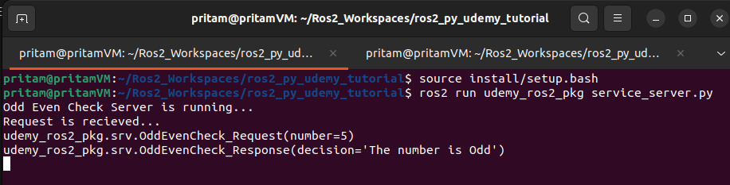

---

[← Back to Contents](00_Contents.md) | [← Previous Lesson: Chapter 25 — Creating a Service Server (C++)](25_Creating_a_Service_Server_Cpp.md) | [Next Lesson: Chapter 27 — Project 3 — Using OpenCV with ROS2 Services (C++) →](27_Project_Using_OpenCV_with_ROS2_Services_Cpp.md)

