# Chapter 31 — ROS2 Actions (C++)

[← Back to Contents](00_Contents.md) | [← Previous Lesson: Chapter 30 — ROS2 Bag Files](30_ROS2_Bag_Files.md) | [Next Lesson: Chapter 32 — Project 4 — TurtleBot3 Navigation with a Custom A\* Planner & Diagnostic System →](32_Project_TurtleBot3_Navigation_with_Custom_A_Star_Planner_and_Diagnostic_System.md)

---

In this lesson, we will be doing a project walkthrough to explain how to utilise **Action interfaces** in ROS2.

**ROS Action Interfaces** are another **inter-node communication method** just like ROS Services.

| **Action** | **Service** |
| --- | --- |
| Goal | Request |
| Result | Response |
| Feedback | Publisher |

## Project Statement

- We have a **mobile robot**, which is being controlled by an **action client node** and an **action server node.** The **action client node** sends a 3D-coordinate location (**Goal**) to the **action server node.**
- Upon receiving the **Goal** by the **action server node,** the robot starts **moving/navigating** - from its current location - to the given **Goal Point**. While the robot is navigating to the given **Goal Point**, the **action server node** keeps sending data **(Feedback)** - back to the **action client node** - on how far is the robot currently from the given **goal point.**
- When the robot reaches its destination, the **action server node** returns **the time,** on how long it took for the robot to reach its destination, to the **action client node,** as **Result.**

    | **Goal** | (x,y,z) coordinates |
    | --- | --- |
    | **Feedback** | Distance remaining |
    | **Result** | Time Elapsed |

- Additionally, we will also need to create a **Publisher** (topic: **/robot_position**) - for simulating a **position sensor** - which keeps publishing the **current robot position** of the robot. Our **action server node** will find the distance between the **Goal Coordinate Point** and the simulated **current robot position** to send to the **action client node** as **feedback** on how far the robot is from the **Goal Point** yet.

## Creating The Custom Action Interface

- Create a new folder called **action** inside the **src/udemy_ros2_pkg** package folder of your **ros2_cpp_udemy_tutorial** workspace.

    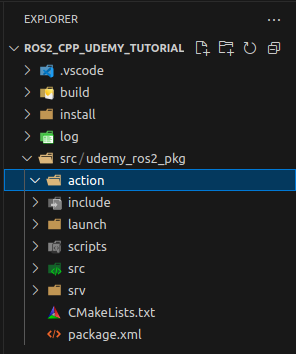

- Within this folder, we will create our own **Custom Action Interface file** named **Navigate.action**.

    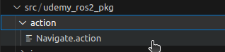

- Add the following code inside **Navigate.action** file.

    ```python
    # Goal
    geometry_msgs/Point goal_point  # x, y, z coordinates
    # geometry_msgs/Point is the ROS Message Datatype for holding 3D spatial coordinates.
    ---
    # Result
    float32 time_elapsed  # in seconds
    ---
    # Feedback
    float32 distance_to_goal  # in meters
    ```

- Save the file and close it.
- Now, move on to the **package.xml** file within your **udemy_ros2_pkg** package folder.

## Configuring The `package.xml` For The Newly Created Custom Action Interface

- Add the following code (**dependencies**) to the **package.xml** file. These dependencies are necessary for integrating **any custom interface** into our ROS package (udemy_ros2_pkg).

    ```xml
    <!-- Adding the below dependency in order to be able to use our Custom ROS Service and Action Interfaces in our package -->
      <!-- The below build_dependency is used to generate the idl(interactive data language) code for our Custom ROS Service and Action Intefaces -->
      <build_depend>rosidl_default_generators</build_depend>
      <!-- Below dependency is added so that the the idl(interactive data language) code can be used at node runtime. -->
      <exec_depend>rosidl_default_runtime</exec_depend>
      <!-- Below dependency is added to include our Custom Intefaces into the ROS2 Interfaces List.  -->
      <member_of_group>rosidl_interface_packages</member_of_group>
    ```

- Also add the following dependency (since we are using the **geometry_msgs** datatype) to the **package.xml** file.

    ```jsx
    <depend>geometry_msgs</depend>
    ```

- Also add the following dependency (only for the case of **Custom Action Interfaces**) to the **package.xml** file.

    ```xml
    <!-- Adding the below dependency is important to be able to use Custom Action Interfaces in our package -->
    <depend>action_msgs</depend>
    ```

- Also add the following dependency (only for the case of **Custom Action Interfaces**) to the **package.xml** file.

    ```xml
     <!-- Adding the below dependency is important to be able to use Custom Action Interfaces in our package -->
     <depend>rclcpp_action</depend>
    ```

- Save the file and close it.
- Now, move on to the **CMakeLists.txt** file within your **udemy_ros2_pkg** package folder.

## Configuring `CMakeLists.txt` For Our Newly Created Custom Action Interface

- Add the following code to the **CMakeLists.txt** file of your **udemy_ros2_pkg** package folder.

    ```python
    find_package(ament_cmake REQUIRED)
    find_package(rclcpp REQUIRED)
    # Adding the below dependency for configuring all the
    # Custom ROS Service AND Action Interfaces created inside this package.
    find_package(rosidl_default_generators REQUIRED)
    # Adding the below dependency to be able to use geometry_msgs interface collection in our codes within this package.
    find_package(geometry_msgs REQUIRED)
    find_package(action_msgs REQUIRED)
    find_package(rclcpp_action REQUIRED)

    # Telling our compiler exactly what new custom interfaces files we have created in our package
    # that needs to have the ros idl code generated for it.
    rosidl_generate_interfaces(${PROJECT_NAME}
      "srv/OddEvenCheck.srv"
      "srv/TurnCameraService.srv"
      "action/Navigate.action"
      DEPENDENCIES
      sensor_msgs
      geometry_msgs
      action_msgs
      ADD_LINTER_TESTS
    )
    # ${PROJECT_NAME} signifies the name of our package (udemy_ros2_pkg)

    # sensor_msgs/msg/Image is the type of message interface that we are using inside the TurnCameraService.srv as response message datatype.
    # geometry_msgs/msg/Point is the type of message interface that we are using inside the Navigate.action custom interface as goal message datatype.
    # We are using action_msgs package for generating our custom action interface Navigate.action
    # Since these message interfaces does not belong to the group of standard message intefaces (std_msgs/msg/**), therefore, we need to include these complete interface collections (sensor_msgs and geometry_msgs) as dependencies in the above code of rosidl_generate_interfaces.

    ```


---

- That is it for configuration of our package for the newly created custom action interface. Rebuild the workspace before proceeding further.

    **Terminal → Run Build Task**

- Now open a terminal from your workspace folder and run the following commands.

    ```bash
    cd Ros2_Workspaces/ros2_cpp_udemy_tutorial/
    source install/setup.bash
    ros2 interface list
    ```

    We can see the name of our newly created custom action interface **udemy_ros2_pkg/action/Navigate** in the output list.

    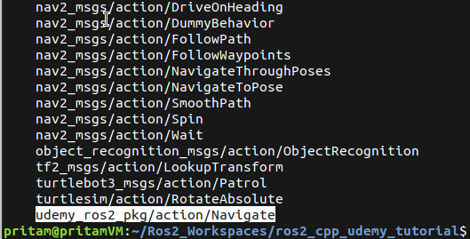

- To see the contents of **Navigate.action** interface, run the following command from the same terminal.

    ```bash
    ros2 interface show udemy_ros2_pkg/action/Navigate
    ```

    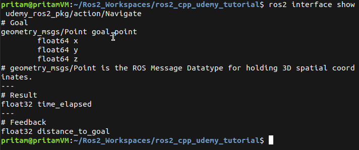


## Writing Our Action Server Node

- Create a new file named **action_server.cpp** inside the **src** folder of the **udemy_ros2_pkg** package folder.
- Add the following code to the file.

    ```c
    #include "rclcpp/rclcpp.hpp"
    #include "rclcpp_action/rclcpp_action.hpp"
    #include "udemy_ros2_pkg/action/navigate.hpp"
    #include "geometry_msgs/msg/point.hpp"

    typedef udemy_ros2_pkg::action::Navigate NavigateAction;
    typedef rclcpp_action::ServerGoalHandle<NavigateAction> GoalHandle;
    using geometry_msgs::msg::Point;

    const double DIST_THRESHOLD = 0.1; // Distance threshold to consider the goal reached

    class NavigateActionServerNode : public rclcpp::Node
    {
        public:
        NavigateActionServerNode() : Node("navigate_action_server_node")
        {
            robot_position_ = Point();  // Initialize robot position (0, 0, 0 - default value)
            robot_position_subscription_ = this->create_subscription<Point>(
                "robot_position", 10,
                std::bind(
                    &NavigateActionServerNode::update_robot_position,
                    this, std::placeholders::_1)
                );
            action_server_ = rclcpp_action::create_server<NavigateAction>(
                this,
                "navigate",
                std::bind(&NavigateActionServerNode::handle_goal,
                    this, std::placeholders::_1, std::placeholders::_2),
                std::bind(&NavigateActionServerNode::handle_cancel,
                    this, std::placeholders::_1),
                std::bind(&NavigateActionServerNode::handle_accepted,
                    this, std::placeholders::_1)
            );
            std::cout << "Navigate Action Server Started" << std::endl;
        }

        private:
        rclcpp_action::Server<NavigateAction>::SharedPtr action_server_;
        Point robot_position_;
        rclcpp::Subscription<Point>::SharedPtr robot_position_subscription_;

        // When a client sends a goal, this function runs immediately.
        // It acts like a "bouncer" at a club. You use this to check if
        // the goal is valid before you waste any resources on it.
        rclcpp_action::GoalResponse handle_goal(
            const rclcpp_action::GoalUUID &uuid,
            std::shared_ptr<const NavigateAction::Goal> goal)
        {
            (void)uuid;  // Not using this argument right now
            std::cout<<"Received goal point: ("
                << goal->goal_point.x << ", "
                << goal->goal_point.y << ", "
                << goal->goal_point.z << ")"
                << std::endl;
            RCLCPP_INFO(this->get_logger(), "Received goal request with x: %f, y: %f", goal->goal_point.x, goal->goal_point.y);
            return rclcpp_action::GoalResponse::ACCEPT_AND_EXECUTE;
            // REJECT : reject the goal
            // ACCEPT_AND_EXECUTE : accept the goal and execute it
            // ACCEPT_AND_DEFER : accept the goal but execute it later
        }

        rclcpp_action::CancelResponse handle_cancel(
            const std::shared_ptr<GoalHandle> goal_handle)
        {
            std::cout<<"Received cancel request for goal point: ("
                << goal_handle->get_goal()->goal_point.x << ", "
                << goal_handle->get_goal()->goal_point.y << ", "
                << goal_handle->get_goal()->goal_point.z << ")"
                << std::endl;
            RCLCPP_INFO(this->get_logger(), "Received request to cancel goal");
            return rclcpp_action::CancelResponse::ACCEPT;
            // REJECT : server will not try to cancel the goal request
            // ACCEPT : server has agreed to cancel the goal request
        }

        // This callback is called when the goal is accepted
        void handle_accepted(
            const std::shared_ptr<GoalHandle> goal_handle)
        {
            // Start a new thread to prevent executing the ROS executor
            std::thread(std::bind(&NavigateActionServerNode::execute,
                this, goal_handle)).detach();
        }

        // This callback is called when the goal is executed
        void execute(const std::shared_ptr<GoalHandle> goal_handle)
        {
            std::cout<<"Executing goal point: ("
                << goal_handle->get_goal()->goal_point.x << ", "
                << goal_handle->get_goal()->goal_point.y << ", "
                << goal_handle->get_goal()->goal_point.z << ")"
                << std::endl;

            // Now our robot will start moving towards the goal point
            // Registering the start time of the goal execution
            auto start_time = rclcpp::Clock().now();

            const auto goal = goal_handle->get_goal();
            auto feedback = std::make_shared<NavigateAction::Feedback>();
            auto result = std::make_shared<NavigateAction::Result>();

            feedback->distance_to_goal = 5; // Initialize distance to goal to get the while loop started
            rclcpp::Rate loop_rate(1);  // This will make the feedback loop (written below) to
                                        // publish 1 feedback message per second (1Hz).
            while (feedback->distance_to_goal >= DIST_THRESHOLD)
            {
                feedback->distance_to_goal = std::sqrt(
                    std::pow(goal->goal_point.x - this->robot_position_.x, 2) +
                    std::pow(goal->goal_point.y - this->robot_position_.y, 2) +
                    std::pow(goal->goal_point.z - this->robot_position_.z, 2)
                );
                goal_handle->publish_feedback(feedback);
                loop_rate.sleep();  // sleep for 1 second after publishing feedback message
            }

            // Once we have reached our destination/goal point, now its time to set the result
            // Registering the end time of the goal execution
            auto end_time = rclcpp::Clock().now();
            // Setting the result
            result->time_elapsed = start_time.seconds() - end_time.seconds();
            // Passing the final result to the goal handle
            goal_handle->succeed(result);

            std::cout << "Goal point reached" << std::endl;
        }

        // This callback is called when the robot position is updated by the subscriber
        void update_robot_position(const Point &msg)
        {
            robot_position_ = msg;
        }
    };

    int main (int argc, char **argv)
    {
      rclcpp::init(argc, argv);
      rclcpp::spin(std::make_shared<NavigateActionServerNode>());
      rclcpp::shutdown();
      return 0;
    }
    ```

- **Save** the file before closing it.
- Mention the file inside **CMakeLists.txt** file of the package in the following block of code.

    ```c
    # Process the custom action definition and generate the necessary
    # C++, Python, and specialized typesupport headers/libraries.
    # geometry_msgs: Required because Navigate.action uses 'geometry_msgs/Point'
    # action_msgs:   Required for all Action definitions to handle goal/result metadata
    rosidl_generate_interfaces(${PROJECT_NAME}
    	"action/Navigate.action"
    	DEPENDENCIES
    	geometry_msgs
    	action_msgs
    	ADD_LINTER_TESTS
    )
    # First, fetch the internal name of the generated interface library
    rosidl_get_typesupport_target(cpp_typesupport_target "${PROJECT_NAME}" "rosidl_typesupport_cpp")

    add_executable(action_server src/action_server.cpp)
    ament_target_dependencies(action_server rclcpp std_msgs geometry_msgs action_msgs rclcpp_action)
    target_link_libraries(action_server "${cpp_typesupport_target}")

    install(TARGETS
            action_server
            DESTINATION lib/${PROJECT_NAME}
    )
    ```

- Save and close everything and build the workspace using `colcon build` command.

## Testing the newly created Action Server Node:

- Testing our newly created **action_server** node: Open a new terminal and run the following commands from a terminal that is opened inside the **ros2_cpp_udemy_tutorial** workspace.

    ```bash
    source install/setup.bash
    ros2 run udemy_ros2_pkg action_server
    ```

    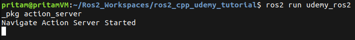

- Keeping the **action_server** terminal open, if you open a second terminal and run the `ros2 node list` command, you will see the following output:

    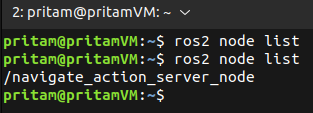

- To see the list of topics, run the command `ros2 topic list` from the second terminal:

    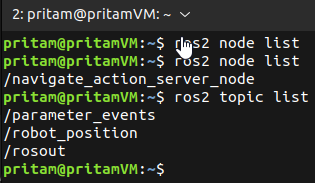

- Sometimes, some topics in the ROS2 network stay hidden and are not shown upon running the `ros2 topic list` command. To see the complete list of all the active topics along with the hidden topics, run the command `ros2 topic list --include-hidden-topics`:

    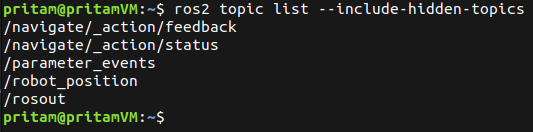

- To see the list of active ROS2 actions run the command `ros2 action list`:

    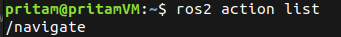

- Now, currently we have not written any C++ code for our action client, but we can still send goals to the action server through the terminal commands. Let us say that we want to send the goal of making our robot move to the point {x = 1.0, y = 1.0, z = 0.0} — and we also want to see the continuous feedback messages published by the action server while the server is processing the action request. To do so,
    - Keep the terminal running the **action_server** node open.
    - Open a new terminal. Source the ROS2 installation; source the workspace; and run the command — `ros2 action send_goal --feedback /navigate udemy_ros2_pkg/action/Navigate "{goal_point: {x: 1.0, y: 1.0, z: 0.0}}”`

    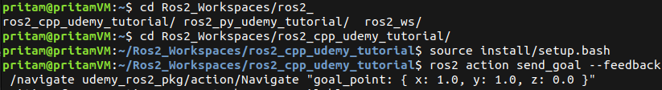

    The output of this command currently looks something like this:

    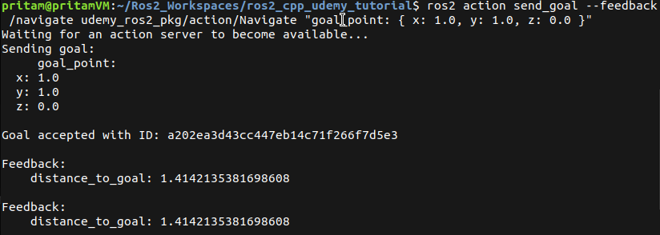

- You can see that currently it is publishing a constant feedback value i.e **1.414.** That is because the responsibility of updating the current position of the robot in our **action_server** code lies upon a subscriber which is subscribed to a **robot_position** topic for getting the updates about the current robot position. The feedback calculator loop then takes this newly updated current position of the robot and calculates the distance remaining to reach the goal. But there is currently no publisher who is publishing the latest position updates to the topic. Hence the current position of the robot stays the same which is in fact the initial starting position of the robot. And so, in theory, our robot is still in the same place. Hence the feedback value which is actually the current distance of the robot from the goal point is seen as constant.

    In the action_server terminal, you will see the following messages:

    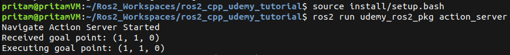

    Now, to create the illusion of the moving robot, we will manually publish a new position value of the robot to the topic **robot_position.** To do that,

    - Keep the **action_server** terminal alive.
    - Keep the **send_goal** terminal alive
    - Open a new third terminal. And run the following command in it (Through this command we are updating the robot position to {x = 1.0, y = 0.0, z = 0.0}): `ros2 topic pub /robot_position --once geometry_msgs/msg/Point "{ x: 1.0, y: 0.0, z: 0.0 }”`

    This will update the current position of the robot to **{x = 1.0, y = 0.0, z = 0.0}** and the value of the feedback message in terminal 2 (send_goal) will change to **1.0**.

    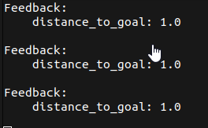

- Next, in the terminal 3 (topic pub terminal) we will update the position of the robot to **{x = 1.0, y = 1.0, z = 0.0}.** Hence, run the following command in terminal 3 (topic pub terminal): `ros2 topic pub /robot_position --once geometry_msgs/msg/Point "{ x: 1.0, y: 1.0, z: 0.0 }”`

    This will create the illusion that the robot has reached its goal point. Hence, you will see the following messages in terminals 1 and 2:

    **Terminal 1 (action_server):**

    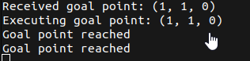

    **Terminal 2 (send_goal):**

    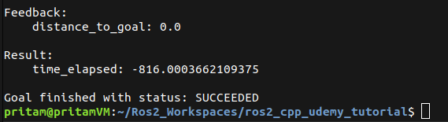


Now, we will be creating a client node to communicate with our action server. Stay tuned!

For now, close all the opened terminals and head over to the VS code.

## Writing our Action Client Node

- Create a new file named **action_client.cpp** inside the **src** folder of the **udemy_ros2_pkg** package folder.
- Add the following code to the file.

    ```cpp
    #include "rclcpp/rclcpp.hpp"
    #include "rclcpp_action/rclcpp_action.hpp"
    #include "udemy_ros2_pkg/action/navigate.hpp"
    #include "geometry_msgs/msg/point.hpp"

    typedef udemy_ros2_pkg::action::Navigate NavigateAction;
    typedef rclcpp_action::ClientGoalHandle<NavigateAction> GoalHandle;
    using geometry_msgs::msg::Point;
    // Both typedef and using serve the same purpose.

    class NavigateActionClientNode : public rclcpp::Node {
    public:
        NavigateActionClientNode() : Node("navigate_action_client_node") {
            std::cout << "Navigate Action Client Started" << std::endl;
            action_client_ = rclcpp_action::create_client<NavigateAction>(
                this,
                "navigate"  // name of the action
            );

            prompt_user_for_goal();
        }

    private:
        rclcpp_action::Client<NavigateAction>::SharedPtr action_client_;

        void prompt_user_for_goal() {
            auto goal_msg = NavigateAction::Goal();

            std::cout << "Enter an X-coordinate to travel to: ";
            std::cin >> goal_msg.goal_point.x;

            std::cout << "Enter a Y-coordinate to travel to: ";
            std::cin >> goal_msg.goal_point.y;

            std::cout << "Enter a Z-coordinate to travel to: ";
            std::cin >> goal_msg.goal_point.z;

            // Wait for the action server to be available
            this->action_client_->wait_for_action_server();
            std::cout << "Action server is available, sending goal..." << std::endl;

            // Before sending the goal, we need to set the send_goal_options
            // send_goal_options is used to set the callback functions that
            // will run when we recieve the any goal feedbacks or the goal result
            // or the status that the goal is accepted or rejected.
            // Basically, it tells the action client what to do when it receives
            // any kind of response from the goal server
            auto send_goal_options = rclcpp_action::Client<NavigateAction>::SendGoalOptions();

            // Setting calback for what to do when the goal is accpeted or rejected
            send_goal_options.goal_response_callback =
                std::bind(&NavigateActionClientNode::goal_response_callback, this, std::placeholders::_1);

            // Setting calback for what to do upon recieving feedback from the action server
            send_goal_options.feedback_callback =
                std::bind(&NavigateActionClientNode::feedback_callback, this, std::placeholders::_1, std::placeholders::_2);

            // Setting calback for what to do when the result is recieved
            send_goal_options.result_callback =
                std::bind(&NavigateActionClientNode::result_callback, this, std::placeholders::_1);

            // Now, all the goal response callbacks are set, now its time to send the goal
            // Send the goal to the action server
            this->action_client_->async_send_goal(goal_msg, send_goal_options);
        }

        // what to do when the goal is accpeted or rejected
        void goal_response_callback(GoalHandle::SharedPtr goal_handle) {
            // Verify if goal_handle exists i.e goal was accepted by the server or
            // if the goal_handle is null i.e goal was rejected by the server
            if (!goal_handle.get()) {
                std::cout << "Goal was rejected by the server" << std::endl;
                return;
            } else {
                std::cout << "Goal accepted by the server, waiting for result..." << std::endl;
            }
        }

        // Goal Handle: Think of the GoalHandle as a "Tracking Number" or a "Digital Receipt"
        // for the request you just sent to the server.

        // calback for what to do when the result is recieved
        void feedback_callback(
            GoalHandle::SharedPtr goal_handle,
            const std::shared_ptr<const NavigateAction::Feedback> feedback
        ) {
            (void)goal_handle;  // Not using this argument right now
            // Print the feedback message
            std::cout << "Distance to goal: " << feedback->distance_to_goal << std::endl;
        }

        void result_callback(const GoalHandle::WrappedResult &result) {
            // std::cout << "Time elapsed : " << result.result->time_elapsed << std::endl;

            switch (result.code) {
                case rclcpp_action::ResultCode::SUCCEEDED:  // If the result is successfully recieved
                    std::cout << "Goal succeeded" << std::endl;
                    std::cout << "Time elapsed: " << result.result->time_elapsed << " seconds" << std::endl;
                    break;
                case rclcpp_action::ResultCode::ABORTED:    // If the goal was aborted
                    std::cout << "Goal aborted" << std::endl;
                    break;
                case rclcpp_action::ResultCode::CANCELED:   // If the goal was canceled
                    std::cout << "Goal canceled" << std::endl;
                    break;
                default:  // If some unknown result was recieved
                    std::cout << "Unknown result code" << std::endl;
                    break;
            }

            // After recieveing the result, close the node
            rclcpp::shutdown();
        }
    };

    int main(int argc, char **argv) {
        rclcpp::init(argc, argv);
        rclcpp::spin(std::make_shared<NavigateActionClientNode>());
        rclcpp::shutdown();
        return 0;
    }
    ```

- **Save** the file before closing it.
- Mention the file inside **CMakeLists.txt** file of the package in the following block of code.

    ```cpp
    add_executable(action_client src/action_client.cpp)
    ament_target_dependencies(action_client rclcpp std_msgs geometry_msgs action_msgs rclcpp_action)
    target_link_libraries(action_client "${cpp_typesupport_target}")

    install(TARGETS
    				action_server
    				action_client
    				DESTINATION lib/${PROJECT_NAME})
    ```

- Save the **CMakeLists.txt** file.
- Recompile the workspace using `colcon build` command.

## Testing the Action Server and Client

- Open a new terminal and run the following commands to start the action server.

    ```bash
    cd Ros2_Workspaces/ros2_cpp_udemy_tutorial
    source install/setup.bash
    ros2 run udemy_ros2_pkg action_server
    ```

- Open a new terminal and run the following commands to start the action client.

    ```bash
    cd Ros2_Workspaces/ros2_cpp_udemy_tutorial
    source install/setup.bash
    ros2 run udemy_ros2_pkg action_client
    ```

    It will prompt for the goal x-, y-, & z- coordinates. Enter x = 1.0, y = 1.0, z = 0.0

    Now, the action_client terminal will start giving feedback message as “**Distance to goal: 1.41421”.**

- Open new terminal to publish robot position messages to the **robot_position** topic.
    - Enter the following command to make the robot move to x = 1.0, y = 0.0, z = 0.0: `ros2 topic pub /robot_position --once geometry_msgs/msg/Point "{ x: 1.0, y: 0.0, z: 0.0 }”`. This will change the feedback message to “**Distance to goal: 1”.**
    - Next enter the following command to make the robot move to x = 1.0, y = 1.0, z = 0.0: `ros2 topic pub /robot_position --once geometry_msgs/msg/Point "{ x: 1.0, y: 1.0, z: 0.0 }”`. This will move the robot to the goal position and change the feedback message to “**Distance to goal: 0. Goal succeeded”.**

---

[← Back to Contents](00_Contents.md) | [← Previous Lesson: Chapter 30 — ROS2 Bag Files](30_ROS2_Bag_Files.md) | [Next Lesson: Chapter 32 — Project 4 — TurtleBot3 Navigation with a Custom A\* Planner & Diagnostic System →](32_Project_TurtleBot3_Navigation_with_Custom_A_Star_Planner_and_Diagnostic_System.md)

